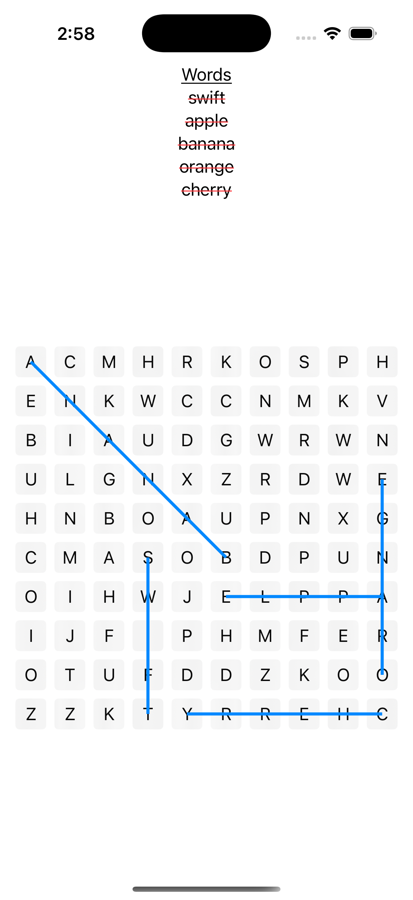

A simple example of the usage of the WordSearchKit library.  
There are a handful of fixed words included in the view model. Tap on the first and last letter in the word and if it matches up it will strike out the word at the top and draw a line over the found word. 

For example:  
